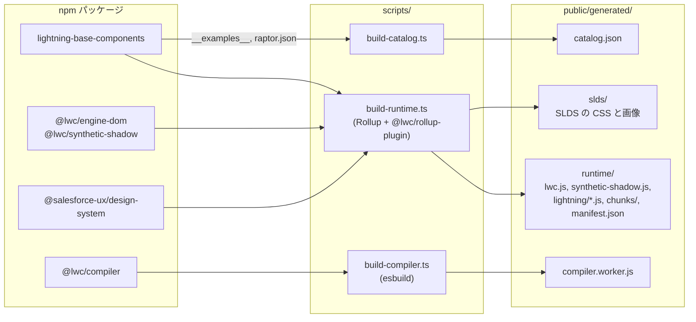
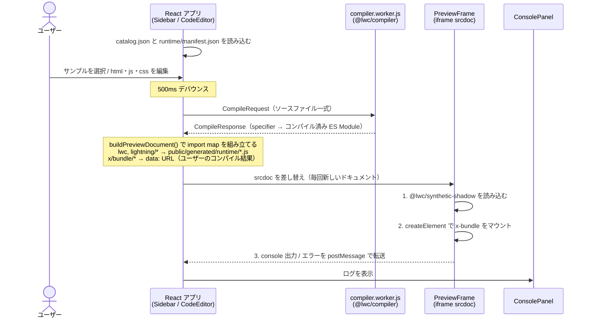

# アーキテクチャ

サーバーサイドは持たず、静的ファイルだけで完結する SPA。

## 全体像

### ビルド時（`npm run assets`）

npm パッケージから、ブラウザが読み込む静的ファイルを `public/generated/` に生成する。

### 実行時（ブラウザ）

コードを編集するたびに、Worker でコンパイルし、新しい iframe でプレビューする。

## ディレクトリ

| パス | 内容 |
|---|---|
| `src/app/` | React アプリ（Vite でビルド） |
| `src/worker/` | コンパイラ Web Worker（esbuild でビルド） |
| `src/shared/` | アプリ・Worker・ビルドスクリプトで共有する型 |
| `scripts/` | 生成物を作るビルドスクリプト（Node の型ストリッピングで `.ts` を直接実行） |
| `scripts/shims/` | ゲート差し替え・Node 組み込みモジュールのスタブ（ビルド対象なので JS のまま） |
| `public/generated/` | `npm run assets` の生成物（git 管理外） |
| `.generated/` | ビルド中間ファイル（git 管理外） |

## モジュール解決の仕組み

- ユーザーのバンドルは名前空間 `x` 固定。サンプル名がそのままバンドル名になる（例: `input` の `text` サンプル → `<x-text>`）。
- Worker はコンパイル結果内の相対 import（`./text.html`, `./generateData`）を `x/text/text.html`, `x/text/generateData` に書き換える。iframe の import map でそれらを data: URL に解決する。
- テンプレートは `./<name>.css` と `./<name>.scoped.css?scoped=true` を暗黙に import するので、ファイルがなければ空モジュールを用意する（`@lwc/rollup-plugin` と同じ振る舞い）。
- `lightning/*` のうちパッケージの `lwc.expose` にある公開モジュールを、ランタイムビルドで 1 モジュール 1 エントリとして出力する。共通部分は `chunks/` に分割され、エンジン（`lwc`）は 1 インスタンスに共有される（詳細は [decisions.md](./decisions.md) #13）。

## プレビューが毎回 iframe を作り直す理由

カスタム要素（`x-text` など）は一度 `customElements` に登録すると再定義できず、LWC エンジンもグローバル状態を持つ。コードを変更するたびに `srcdoc` を差し替えて新しいドキュメントで実行するのが最も単純で確実。
